# AI/ML SageMaker Workshop

_Versão minimizada do SageMaker Immersion Day: https://catalog.us-east-1.prod.workshops.aws/workshops/63069e26-921c-4ce1-9cc7-dd882ff62575/en-US/_

## Acessando a conta de laboratório

1- Vá para https://dashboard.eventengine.run/login:
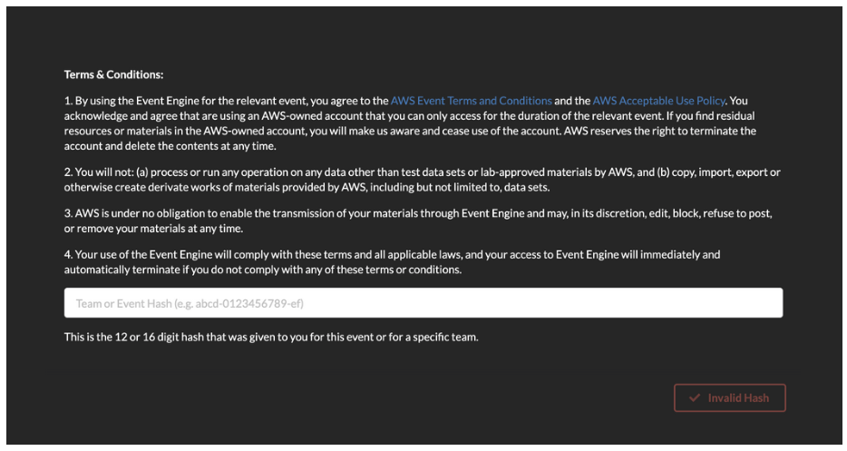

2- Entre com o hash do evento:
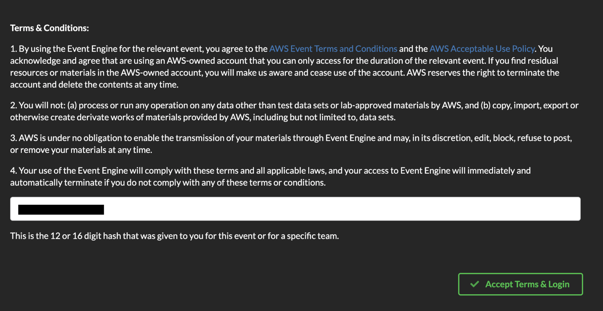

3- Clique em **Email one-time password (OTP)**.

4- Entre seu e-mail e digite a senha recebida:
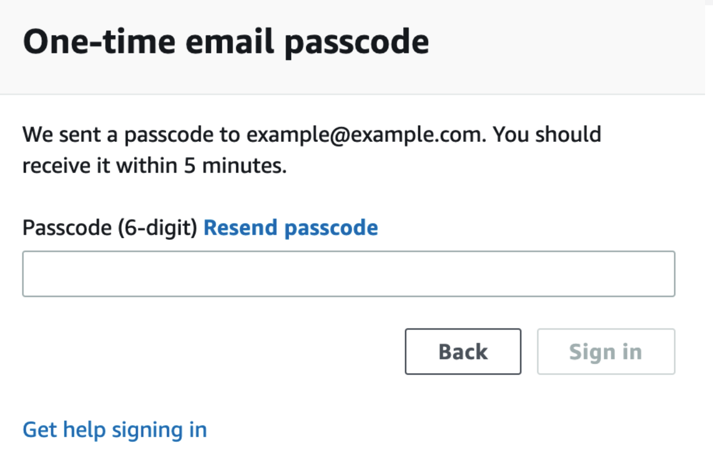

5- Clique em **AWS Console**:
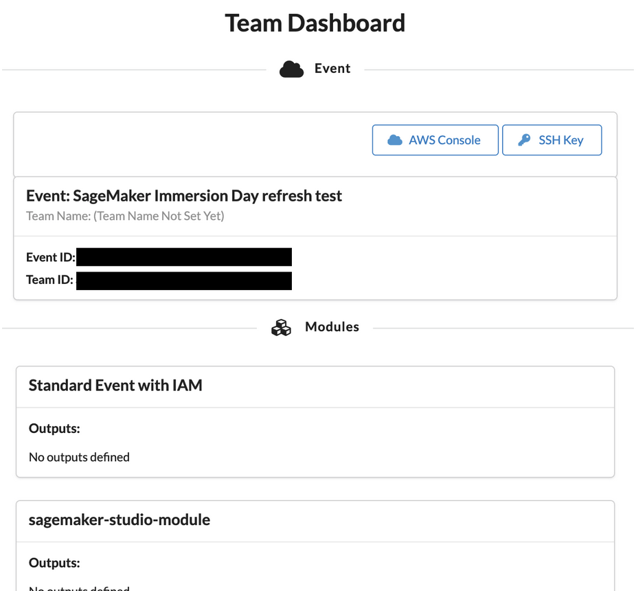

6- Clique em **Open AWS Console**:
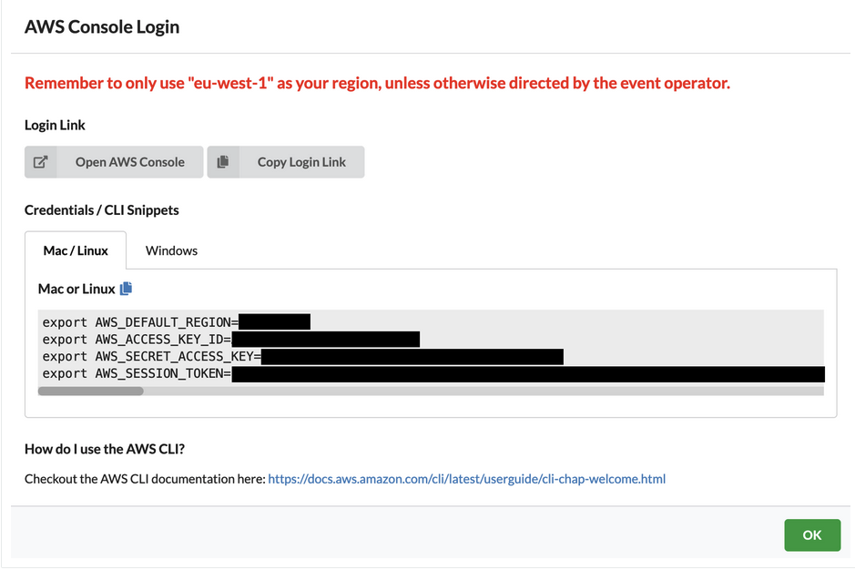

## Primeiro acesso ao SageMaker Studio

1- Na console AWS verifique a região **N. Virginia**:
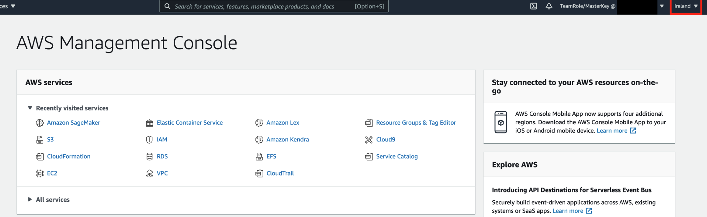

2- Busque por **SageMaker**:
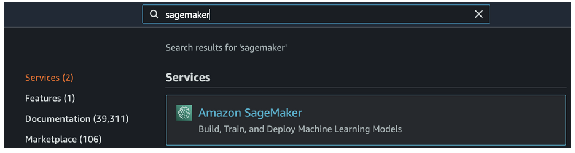

3- Clique em **SageMaker Studio**:
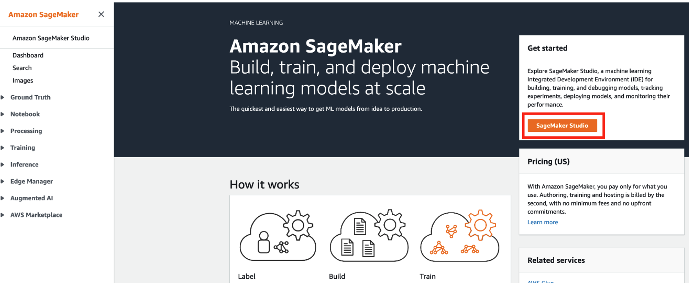

4- Clique em **Launch App Studio** para o usuário **sagemakeruser**:
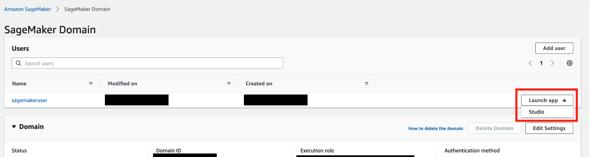

5- Em **Notebook and compute resources** selecione o Notebook Python 3:
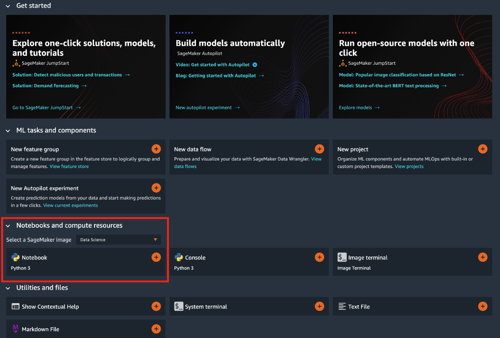

6- Faça o download do conteúdo do workshop através do terminal do Notebook:
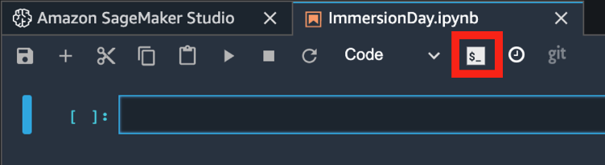

```
git clone https://github.com/gabrielmartinigit/aiml-notebooks.git
```
